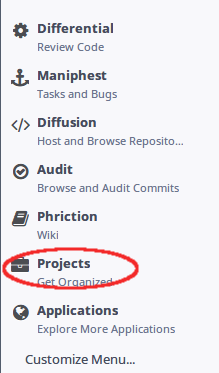
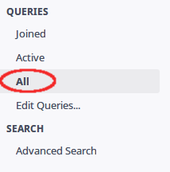
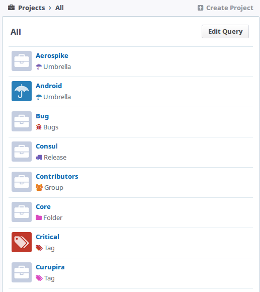
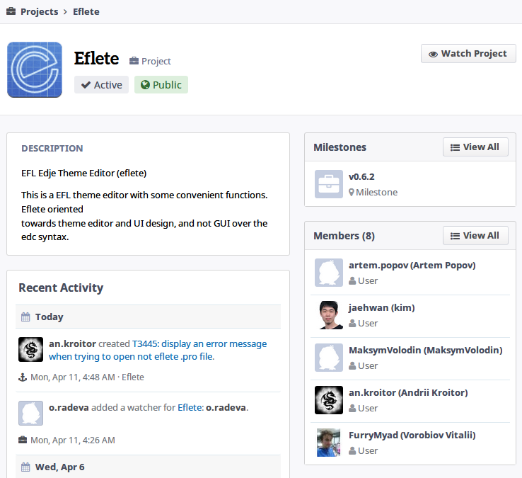
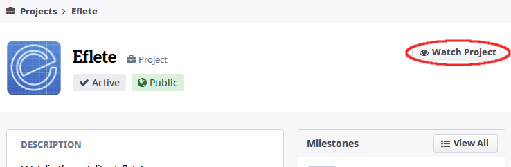
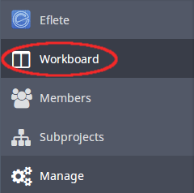
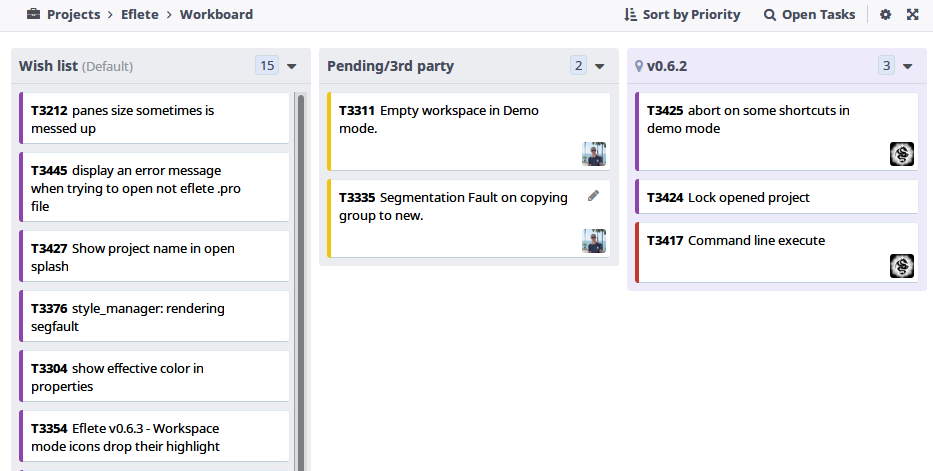

# Projects

---

## What's it?
Projects, no Phabricator, são pequenos "espaços" dedicados para agrupar e
generenciar grupos de tasks do Maniphest, ou mais ainda, gerenciar grupos de
pessoas e suas diversas ações dentro do proprio Phabricator.

Para acessá-lo, clique em `Projects` localizando no menu a esquerda.

Caso não esteja em projeto algum, mude para `All` no menu `Queries` para
visualizar a lista de todos os projetos.

Clique em algum projeto para visitarmos sua página.

Na página do projeto, temos algumas informações como descrição, atividade
recente, membros etc.

Para receber notificações de um projeto, basta se inscrever nele clicando no
botão `Watch Project`, localizado no canto superior direito.

## Tasks Status
Para verificar o andamento das tarefas de determinado projeto, basta acessar a
`Workboard` do projeto.

Já ná pagina da `Workboard`, podemos observar as mais diversas *tasks*,
organizadas em multiplas seções.

