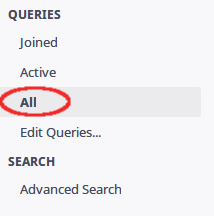
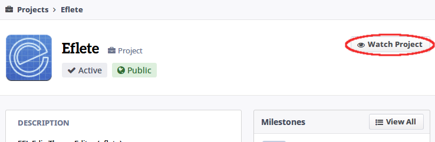

# Projects

---

## What's it?
Projects, on Phabricator, are small workspaces dedicated to group and manage people and their actions within the Phabricator.

In order to access it, click on `Projects`, located on the menu in the left.

If you aren't in any project, change to `All` in the `Queries` menu in order to list all projects.

Click on any project to visit its page.

The project's page shows some informations about the project, like its description, recent activity, members etc

To receive notifications about a project, just subscribe by clicking on the `Watch Project` button, located on the upper-left corner.

## Tasks Status

To check the current progress of a project's task, just access its `Workboard`.

Now, on the `Workboard` page, we can see a bunch of *tasks* organized in sections.

