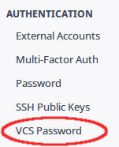

# Setting up Phabricator

---

## Registering a new account ...

O Phabricator possui suporte a vários métodos de autenticação, onde você pode
se registrar diretamente pelo site ou, se preferir, usar sua conta em
alguns sites de terceiros como `google`, `github` e `facebook`.
> Ao autenticar-se utilizando de serviços de terceiros, não teremos acesso a
> informações sensíveis tais como seu login e senha no serviço.

### ... with Phabricator

Para registrar uma nova conta diretamente pelo Phabricator, clique em `Register
New Account`.

Já no formulário de registro, preencha os campos com os dados informados:
- `Phabricator Username` Nome de usuário desejado para logar-se no Phabricator
- `Real Name` Seu nome completo
- `Password` e `Confirm Password` Senha desejada (mínimo de 8 caracteres)
- `Email` Email com o qual deseja se registrar, será enviado um código de
confirmação ao mesmo

Após preencher o *captcha*, clique em `Register Phabricator Account` para
concluir o registro de sua conta

Agora é só acessar o email cadastrado e clicar no link de confirmação que
foi enviado para ele.

### ... with third-party services
T O D O

## Account settings

Com a conta criada e logado, precisamos, ainda, configurar mais alguns
detalhes.
Para isso, clique no ícone de ferramenta localizado no canto superior direito.

### VCS password

Precisamos criar uma senha para nos autenticar na hora de acessar os
repositórios.

No menu esquerdo, na seção `Authentication`, clique em `VCS Password`.

Nos campos `New VCS Password` e `Confirm VCS Password`, preencha com uma senha
a sua escolha, ou use a senha gerada automaticamente pelo Phabricator.

### Email settings

O campo `Self Actions` vem com a opção `Send me email when I take an action`,
mude para `Do not send me an email when I take an action`.

