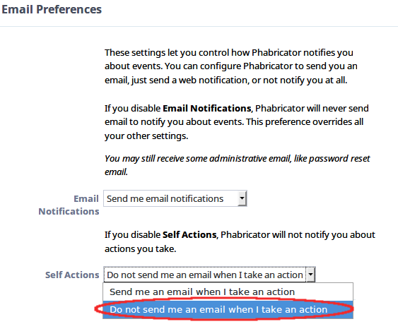

# Setting up Phabricator

---

## Registering a new account ...

There are several ways to authenticate to Phabricator. You can register directly through the website or you can just an existing account from others services like `google`, `github` or `facebook`.
> When you authenticate using third-party sevices, we do not get
> access to sensible data like your login and password.

### ... with Phabricator

To register a new account with Phabricator, just click on `Register New Account`.

Now on the registration form, fulfill the fields with the required data:
- `Phabricator Username` Desired username to login
- `Real Name` Your complete name
- `Password` and `Confirm Password` Desired password (minimum of 8 characters)
- `Email` Email to send the confirmation code

After solving the *captcha*, click on `Register Phabricator account` to finish your account setup.

After this, check the registered email and click confirmation link received.

### ... with third-party services
T O D O

## Account settings

With the account created and logged in, we still need to configure some options.
To do this, click tool icon located in the upper-left corner.

### VCS password

We need to create a password to use when accessing the repositories

In the left menu, at `Authentication` session, click on `VCS Password`.

On the `New VCS Password` and `Confirm VCS Password` fields, fill with the desired password or use the one generated by Phabricator

### SSH Keys

In order to authenticate using `ssh` instead of `http` when cloning the repository, [generate a SSH key](https://help.github.com/articles/generating-a-new-ssh-key-and-adding-it-to-the-ssh-agent/) if you don't have one already and then click on `Upload public key`.

Give your public-key a name to help identifying it and copy into the `Public Key` field.

### Email settings

The `Self Actions` field has a default option `Send me email when I take an action`, change it to `Do not send me an email when I take an action`.

