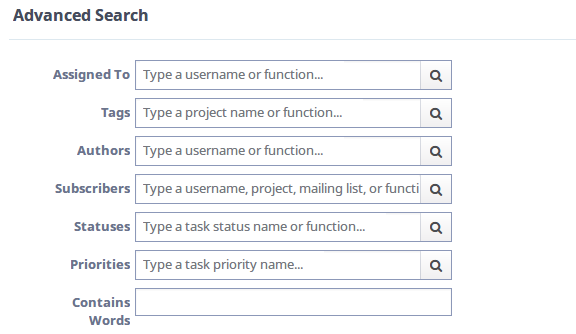
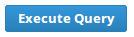
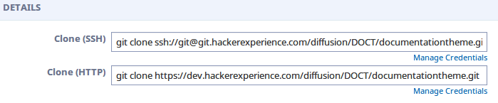
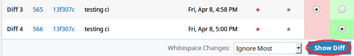
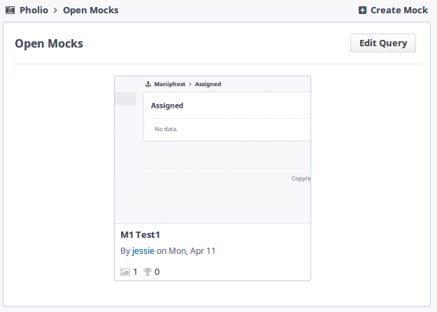
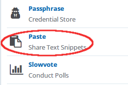
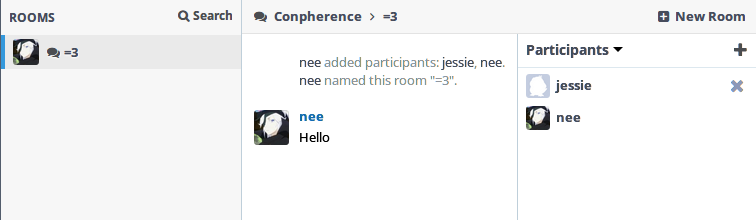
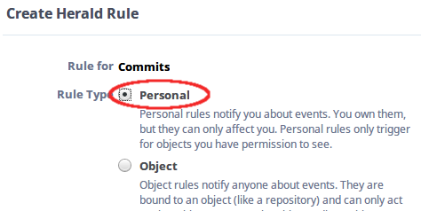
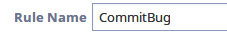

# Phabricator

---

## Maniphest
Maniphest é o gerenciador de tasks do Phabricator.
Sua interface é bem intuitiva.

Do lado esquerdo, em *Queries*, temos como filtrar as tasks existentes.
Por default, temos o acesso rápido aos filtros
- Assigned: tasks assignadas para você
- Subscribed: tasks em que você está inscrito
- Open Tasks: tasks que estão em aberto
- All Tasks: todas as tasks visíveis para você

Já na seção *Search*, podemos fazer buscas por tasks usando o `Advanced Search`.

A maioria dos campos são auto-explicativos e, ao clicar na lupa presente em
alguns campos, será listado para você uma lista interativa de objetos para
compor a sua busca.

Após preencher os campos com o que deseja buscar, basta clicar no botão
`Execute Query` para realizar a busca.

### Creating tasks

Para criar uma nova task, basca clicar no botão `Create Task`, localizado no
canto superior direito.

Logo após, aparecerá um menu com as possíveis tasks a serem criadas

#### Request a Feature
Como o próprio nome sugere, é o formulário para enviar uma sugestão de feature.
Deve conter o título e, se possível, uma descrição da Feature.

#### Report a Bug
Quando você encontra um bug, pode reportá-lo pelo proprio Maniphest.

Além do título, descrição e tags, você deve selecionar uma prioridade para o bug

#### Custom Task

---

## Diffusion
Diffusion é o sistema de repositórios do Phabricator

Do lado esquerdo, temos as `Queries`, que filtram rapidamente os repositorios em
*Active Repositories* ou, se preferir, *All Repositories*.
Também é possível fazer buscas mais complexas utilizando-se da
`Advanced Search`.

Do lado direito, temos a listagem de repositórios segundo a *query* escolhida.
Cada repositório apresenta algumas informações de forma resumida, para acessar o
repositório basta clicar no seu nome.

### Repository page
Na página do repositório, temos acesso a vários informações, tais como histórico
de commits, branches e navegar pelos arquivos.

Em `Details`, temos as informações necessárias para *clonar* o repositório, no
caso utilizando-se da ferramenta *git*.

Outra seção bem útil é a que nos permite navegar pelo conteúdo do repositório,
normalmente está sob o nome do próprio repositório. Ao clicar
`Browse Repository`, poderá navegar por todos os arquivos do repositório.

Também há possibilidade de navegar pelo histórico de commits

---

## Differential
Differential é o sistema de review de código do Phabricator

### Review Page
A primeira seção nos mostra informações básicas a respeito do review, tais como
autor, projeto, comando para aplicar o *Patch* e o `Sumário`, que é um resumo do
diff.

Nos detalhes do diff, temos:
- Nome do repositorio
- Branch
- Lint (verificador de erros)
- Unit (para testes unitários)
- Build status (indicando se a build foi bem sucedida ou não)

Em `Revision Update History`, temos o histórico de *diffs* dessa revisão.

Onde o podemos compará-los entre si, selecionando um para ser a base
(em vermelho) e outro para ser a atualiazação (em verde) e clicando no botão
`Show Diff`.

Logo mais abaixo, podemos visualizar a diferença entre os arquivos do *diff*

---

## Pholio
Pholio te permite fazer o upload de imagens de mocks para revisão

Para visualizar os detalhes de um mockup, basta clicar no nome dele

### Mockup page
Na página do mockup, podemos visualizar mais informações sobre o mockup

Na seção `Image`, podemos visualizar as imagens com comentários do mockups por
revisão.

Já em `History Beckons`, podemos postar comentários sobre o mockup.

### Creating mockups
Para criar um novo mockup, clique no botão `Create Mock` localizado no canto
superior direito.

Na página de criação, teremos que preencher um formulário com as informações a
respeito do novo *Mock*.

Em `Projects` e `Subscribers`, você pode clicar na lupa
 para buscar objetos relativos a cada campo.

Não se esqueça de adicionar as imagens do Mockup no espaço *Drag and drop*

Depois de tudo pronto, só clicar no botão `Create`

---

## Paste
O sistema de paste te permite fazer o upload de arquivos de texto.

Para acessá-lo, clique em `Applications`, localizando no menu esquerdo.

Na lista de aplicativos, procure pelo `Paste`

E pronto, terá acesso a lista de pastes, podendo filtra-los com as `Queries`

### Creating pastes

Para criar um novo paste, basta clicar no botão `Create Paste`, localizado no
canto superior direito

No formulário seguinte, preencha o título com o nome que desejar e, se quiser
que o proprio Paste detecte a linguagem utilizada (para syntax highlighting),
coloque também uma extensão depois do nome.

Se preferir, pode selecionar uma das linguagens disponiveis no campo `Language`

Digite ou copy-paste dentro o texto/código que deseja subir pro Paste

Selecione as visibilidade, possibilidade de edição, tags e subscribers
desejados.

Agora, pra finalizar, basta clicar no botão `Create new paste`.

---

## Conpherence
Conpherence é o serviço para conversação do Phabricator, que lhe permite
conversar em grupo ou privadamente com outras pessoas

Para acessa-lo, selecione `Applications` no menu esquerdo da página principal, e
depois procure por `Conpherence`.
Você se depará com a sua página inicial.

### Checking messages
Para visualizar mensagens, o jeito mais fácil é clicando no ícone no canto
superior esquerdo, em formato de balão  e selecionando
a room desejada.

Se preferir, pode checar na própria página do Conpherence.

### Creating a new room
Para criar uma nova sala, basta clicar no botão `New Room`, localizado no campo
superior direito.

No formulário de criação, dê um nome para a sala e selecione os participantes
(podendo ser uma ou mais pessoas). Lembrando que você pode pesquisar por
usernames clicando no icone de lupa .

Após configurar as opções extras como desejar, basta clicar no botão
`Create Room`.

---

## Herald
Com o Herald, podemos configurar diversas regras de notificação para
modificações no Phabricator.
Para acessa-lo, procure-o na lista de aplicativos.

### Creating a new rule
Para criar uma nova regra, clique no botão superior direito `Create Herald Rule`

Nesse exemplo, criaremos uma regra para nos notificar via email toda vez que
houver um commit com a mensagem contendo a palavra `bug`

No primeiro formulário, selecione a opção `Commits` e clique em `Continue`.

Como só queremos nos notificar, selecione a opção `Personal`.

Em `Rule Name`, dê um nome para a notificação, no exemplo usarei `CommitBug`.

Em conditions, escolhemos "When **all of** ...", já que queremos que nos
notifique para todos os commits.
Nos campos seguintes, escolha respectivamente: `Commit message`, `contains` e,
no campo de texto, digite `bug`.
Para criar a condição, clique em `New Condition`.

Agora, na seção `Action`, selecione `Send me an email` e, em seguida, no botão
`New Action`

Com tudo feito, clique em `Save Rule` e você será redirecionado para a página da
regra recém-criada.

