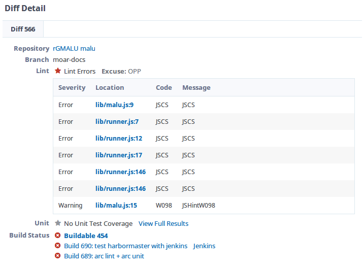

# Phabricator

---

## Maniphest
Maniphest is the Phabricator's task manager.
It's interface is pretty intuitive.

On the left side, we can filter all existing tasks through *Queries*.
By default, we have a quick access to the following filters:
- Assigned: tasks assigneds to you
- Subscribed: tasks you're subscribed
- Open Tasks: self explanatory
- All Tasks: all tasks that are visible to you

The *Search* sections gives a way to perform a detailed search through `Advanced Search`.

The vast majority of fields are self explanatory and, when clicking on the magnifier icon, you'll see a interactive list of object to compose the search.

After filling the fields with what you want to search, just click `Execute Query` to perform the search.

### Creating tasks

To create a new task, just click `Create Task`, located in the upper-right corner.

Soon after that, a menu will show up with all possible tasks to be created.

#### Request a Feature
As the name suggests, it's the form to send a feature suggestion.
Must have a title and, if possible, a description of the Feature.

#### Report a Bug
When you find a bug, you can report it through Maniphest itself.

In addition to the title, description and tags, you must select a priority to the bug.

#### Custom Task

---

## Diffusion
Diffusion is the Phabricator's repository system

On the left side, you can quickly filter repositories with `Queries`, that can filter by *Active Repositories* and *All Repositories*.
Also, you can perform complex searches using the `Advanced Search`

On the right side, there's the listing of repositories according to our *query*.

### Repository page
On the repository's page, we have access to a lot of useful information, like commits history, branches and files browsing.

On `Details`, we have the necessary information to *clone* the repository, in the case we'll be using the *git* tool.

Another useful section is the one which let us browser through the repository's content, usually it's under the repository's name. Clicking `Browser Respository`, you will be able to browser over all of the repository's files.

You can also browse through the commits' history.

---

## Differential
Differential is the Phabricator's code review system

### Review Page
The first section show us some basic information about the review, such as author, project, *Patch* command, and `Summary`.

The diff's details are:
- Repository's name
- Branch
- Lint (error checker)
- Unit (for unit tests)
- Build status (indicates if the build was succesfull)

Em `Revision Update History`, temos o histórico de *diffs* dessa revisão.

Onde o podemos compará-los entre si, selecionando um para ser a base
(em vermelho) e outro para ser a atualiazação (em verde) e clicando no botão
`Show Diff`.

Logo mais abaixo, podemos visualizar a diferença entre os arquivos do *diff*

---

## Pholio
Pholio te permite fazer o upload de imagens de mocks para revisão

Para visualizar os detalhes de um mockup, basta clicar no nome dele

### Mockup page
Na página do mockup, podemos visualizar mais informações sobre o mockup

Na seção `Image`, podemos visualizar as imagens com comentários do mockups por
revisão.

Já em `History Beckons`, podemos postar comentários sobre o mockup.

### Creating mockups
Para criar um novo mockup, clique no botão `Create Mock` localizado no canto
superior direito.

Na página de criação, teremos que preencher um formulário com as informações a
respeito do novo *Mock*.

Em `Projects` e `Subscribers`, você pode clicar na lupa
 para buscar objetos relativos a cada campo.

Não se esqueça de adicionar as imagens do Mockup no espaço *Drag and drop*

Depois de tudo pronto, só clicar no botão `Create`

---

## Paste
O sistema de paste te permite fazer o upload de arquivos de texto.

Para acessá-lo, clique em `Applications`, localizando no menu esquerdo.

Na lista de aplicativos, procure pelo `Paste`

E pronto, terá acesso a lista de pastes, podendo filtra-los com as `Queries`

### Creating pastes

Para criar um novo paste, basta clicar no botão `Create Paste`, localizado no
canto superior direito

No formulário seguinte, preencha o título com o nome que desejar e, se quiser
que o proprio Paste detecte a linguagem utilizada (para syntax highlighting),
coloque também uma extensão depois do nome.

Se preferir, pode selecionar uma das linguagens disponiveis no campo `Language`

Digite ou copy-paste dentro o texto/código que deseja subir pro Paste

Selecione as visibilidade, possibilidade de edição, tags e subscribers
desejados.

Agora, pra finalizar, basta clicar no botão `Create new paste`.

---

## Conpherence
Conpherence é o serviço para conversação do Phabricator, que lhe permite
conversar em grupo ou privadamente com outras pessoas

Para acessa-lo, selecione `Applications` no menu esquerdo da página principal, e
depois procure por `Conpherence`.
Você se depará com a sua página inicial.

### Checking messages
Para visualizar mensagens, o jeito mais fácil é clicando no ícone no canto
superior esquerdo, em formato de balão  e selecionando
a room desejada.

Se preferir, pode checar na própria página do Conpherence.

### Creating a new room
Para criar uma nova sala, basta clicar no botão `New Room`, localizado no campo
superior direito.

No formulário de criação, dê um nome para a sala e selecione os participantes
(podendo ser uma ou mais pessoas). Lembrando que você pode pesquisar por
usernames clicando no icone de lupa .

Após configurar as opções extras como desejar, basta clicar no botão
`Create Room`.

---

## Herald
Com o Herald, podemos configurar diversas regras de notificação para
modificações no Phabricator.
Para acessa-lo, procure-o na lista de aplicativos.

### Creating a new rule
Para criar uma nova regra, clique no botão superior direito `Create Herald Rule`

Nesse exemplo, criaremos uma regra para nos notificar via email toda vez que
houver um commit com a mensagem contendo a palavra `bug`

No primeiro formulário, selecione a opção `Commits` e clique em `Continue`.

Como só queremos nos notificar, selecione a opção `Personal`.

Em `Rule Name`, dê um nome para a notificação, no exemplo usarei `CommitBug`.

Em conditions, escolhemos "When **all of** ...", já que queremos que nos
notifique para todos os commits.
Nos campos seguintes, escolha respectivamente: `Commit message`, `contains` e,
no campo de texto, digite `bug`.
Para criar a condição, clique em `New Condition`.

Agora, na seção `Action`, selecione `Send me a email` e, em seguida, no botão
`New Action`

Com tudo feito, clique em `Save Rule` e você será redirecionado para a página da
regra recém-criada.

