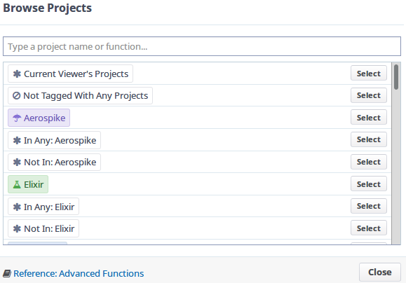
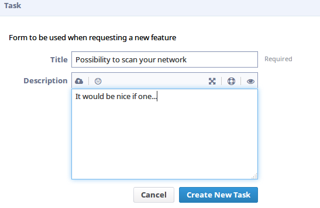
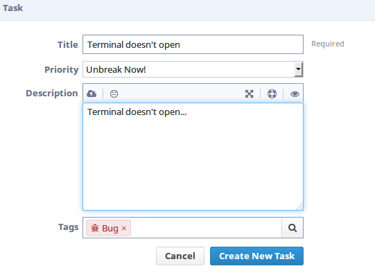
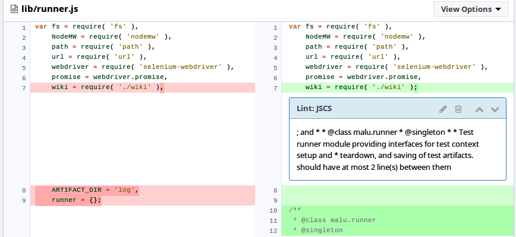

# Phabricator

---

## Maniphest
Maniphest is the Phabricator's task manager.
It's interface is pretty intuitive.

On the left side, we can filter all existing tasks through *Queries*.
By default, we have a quick access to the following filters:
- Assigned: tasks assigneds to you
- Subscribed: tasks you're subscribed
- Open Tasks: self explanatory
- All Tasks: all tasks that are visible to you

The *Search* sections gives a way to perform a detailed search through `Advanced Search`.

The vast majority of fields are self explanatory and, when clicking on the magnifier icon, you'll see a interactive list of object to compose the search.

After filling the fields with what you want to search, just click `Execute Query` to perform the search.

### Creating tasks

To create a new task, just click `Create Task`, located in the upper-right corner.

Soon after that, a menu will show up with all possible tasks to be created.

#### Request a Feature
As the name suggests, it's the form to send a feature suggestion.
Must have a title and, if possible, a description of the Feature.

#### Report a Bug
When you find a bug, you can report it through Maniphest itself.

In addition to the title, description and tags, you must select a priority to the bug.

#### Custom Task

---

## Diffusion
Diffusion is the Phabricator's repository system

On the left side, you can quickly filter repositories with `Queries`, that can filter by *Active Repositories* and *All Repositories*.
Also, you can perform complex searches using the `Advanced Search`

On the right side, there's the listing of repositories according to our *query*.

### Repository page
In the repository's page, we have access to a lot of useful information, like commits history, branches and files browsing.

On `Details`, we have the necessary information to *clone* the repository, in the case we'll be using the *git* tool.

Another useful section is the one which let us browser through the repository's content, usually it's under the repository's name. Clicking `Browser Respository`, you will be able to browser over all of the repository's files.

You can also browse through the commits' history.

---

## Differential
Differential is the Phabricator's code review system

### Review Page
The first section show us some basic information about the review, such as author, project, *Patch* command, and `Summary`.

The diff's details are:
- Repository's name
- Branch
- Lint (error checker)
- Unit (for unit tests)
- Build status (indicates if the build was succesfull)

On `Revision Update History`, we can access the revision's *diff* history.

Which can be compared with each other by selecting a "base" (red), an "update" (green) and clicking `Show Diff`.

Just below, you can see the difference between the *diffs*.

---

## Pholio
Pholio is the Phabricator's image and mock review system.

To see details about a mockup, click on its name.

### Mockup page
Now we can see a more detailed version of the mockup.

In the `Image` section, we can view the mockup's images with comments by revision.

You can post a comment in the `History Beckons` section.

### Creating mockups
To create a new mockup, click `Create mock`, on the upper-right corner.

In the create page, fill out the form with the *Mock*'s information.

On `Projects` and `Subscribers`, you can click on the magnifier  to search for objects.

Don't forget to add images in the `Drag and Drop` area

With everything done, just click `Create`.

---

## Paste
The paste system let you upload text files.

To access it, click `Applications` in the.

In the app list, search for `Paste`.

And it's done, you can now access the list of pastes and filter with `Queries`.

### Creating pastes

To create a new paste, just click `Create Paste` on the upper-right side.

In the next form, fill out the title with the desired name and (optionally) add an extension.

You can select a (programming) language as well in the `Language` field.

Type or copy-paste the code you want to upload

Select the desired visibility, tags, subscribers etc.

To finish, click `Create new paste`.

---

## Conpherence
Conpherence is the Phabricator's chat system.

In order to access it, select `Applications` in the main page's left menu and search for `Conpherence`1

### Checking messages
To view messages, the easiest way is clicking on the bubble icon in the upper-left corner  and selecting a room.

You can also check it in the Conpherence's page.

### Creating a new room
To create a new room, just click `New Room` in the upper-left side.

Fill out the form, by giving it a name and selecting participants.
You can search for usernames clicking on the magnifier icon .

To finish, click `Craete Room`.

---

## Herald
With Herald, we can setup notification rules for events, like modifications, new posts etc.

### Creating a new rule
To create a new rule, click `Create Herald Rule` un the upper-right side.

In this example, we'll be creating a new rule to notify us everytime someone makes a commit with the word `bug`

In the first form, select the option `Commit` and click `Continue`.

As we just want to send notifications to ourselves, select the option `Personal`.

In `Rule Name`, give a name to the notification, in this example I'll give it the name `CommitBug`.

In `Conditions`, select "When **all of** ...", since we want to be notified for every commit.
In the remaining fields, select respectively: `Commit message`, `contains` and type `bug`.
To create the condition, click `New Condition`.

Now, in the `Action` section, select `Send me an email` and then click `New Action`.

With everything done, click `Save Rule` and you'll be redirected to the newly created page.

