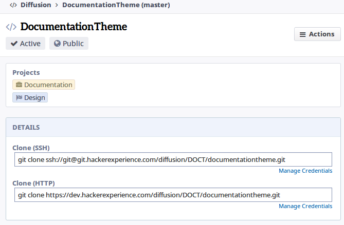
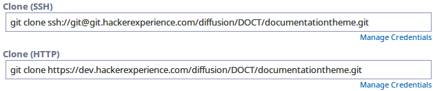

# Workflow

---

## Cloning a repo
Para clonar um repositório, navegue pelo `Diffusion` até o repositório desejado



Na seção `Details` da página do repositório, terá dois campos com o nome clone.
Se você configurou sua `SSH Key`, copie o campo `Clone (SSH)`, caso tenha só
configurado sua `VCS Password`, copie o campo `Clone (HTTP)`.



Com o `git` instalado, abra o seu terminal, cole o conteúdo do campo e aperte a
tecla enter.
O repositório será clonado para a sua máquina.

> Usuários Windows devem abrir o programa `Git BASH` instalado junto com o
`git for windows`

Após clonar o repositório, você já pode trabalhar dentro dele, alterando e
adicionando novos arquivos.


## Submiting changes for review
Para submeter alterações para review, utilizaremos da ferramenta `arc`
(arcanist), mais precisamente, o `arc diff`.
Após fazer alterações no seu repositório local, dê um `git commit -a` e, para
criar o *diff*, execute o comando `arc diff`.

Após a execução, o comando te retornará a URL com o ID do seu *diff*.


## Get review content
Para aplicar o conteudo de uma revisão, basta aplicar o *diff* desejado com o
seguinte comando:`arc patch D(id)`, onde (id) é o ID do *diff*.


## Update a review
Para atualizar um review, mandando ainda mais *diffs*, basta executar
`git commit -a` e `arc diff --update D(id)`, onde (id) é o ID da sua revisão.


## Work on other task while review is not accepted
A melhor maneira de trabalhar em uma nova feature é criando uma branch só pra
isso.
`$ git checkout -b F1`

Após trabalhar nas edições, dê um *commit* seguido de um `arc diff`.
```
$ git commit -a
$ arc diff
```

Agora, se quisermos trabalhar em uma segunda *feature* que dependa do review da
*feature* F1, criamos uma nova branch (tendo a F1 como upstream).
`$ git checkout -b F2`
Continuamos a fazer modificações e, para enviar diffs baseados na F2, só
precisamos fazer um *commit* e `arc diff`
```
$ git commit -a
$ arc diff
```

Caso o precise trabalhar novamente no review da F1 e enviar os diffs, basta dar
checkout na branch F1, commitar as alterações, enviar pelo arc diff, voltar para
a branch F2 (checkout) e dar um rebase.
```
$ git co F1
$ git commit -a --amend
$ arc diff
$ git co F2
$ git rebase -i F1
```

Para finalmente dar *land* na F1, voce deve:
- Dar checkout na branch master
- Atualizar o seu conteudo que pode estar desatualizado
- Dar checkout na branch F1
- Fazer um rebase na branch F1 com base master
- Dar land na F1 pra master
- Arrumar o upstream da branch F2
- Após arrumar o upstream, dar rebase na branch F2 com base na master

Ou seja
```
$ git co master
$ git pull
$ git co F1
$ git rebase master
$ arc land --onto master
$ git co F2
$ git branch --set-upstream-to=master
$ git rebase -i master
```

Após todos esses passos, já pode trabalhar normalmente na segunda feature (F2)
